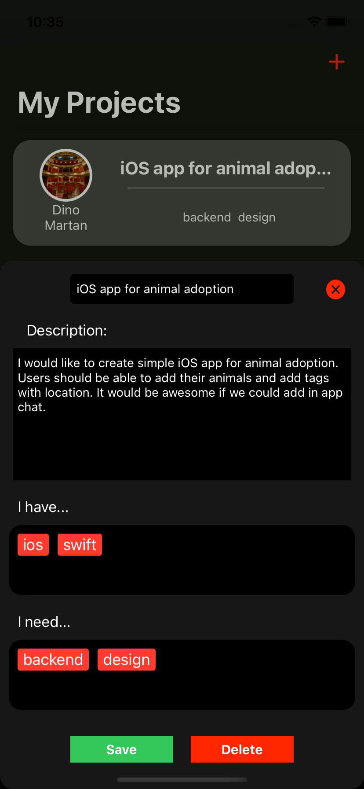

# Connect
We want to make finding like minded people easy. If you are junior developer, trying to learn mobile app development, instead of focusing on your technologies, you have to figure out the backend and design just so you could create app you want to. Similar to that, if you are backend dev, you don’t want to spend time creating UI in technologies you don’t know much about. That’s where we come in. If you have an idea for a fun project, share it on Connect. and let others know who you need. If you need design for an app, tag it. If you need backend devs, tag it. Users can search projects by tags and if they find your idea interesting, they can message you and you can start building your project and make a friend. If, on the other hand, you don’t have idea at the moment, you can brows through other people’s projects and if you see something you like, contact them.  

Testing credentials:  
email: test@test.com  
password: 123456  
Testing credentials:  
email: test2@test2.com  
password: 123456  

Login

  

Home

  
  
  
  

My Projects

  
  

Profile

  

Chat

  

